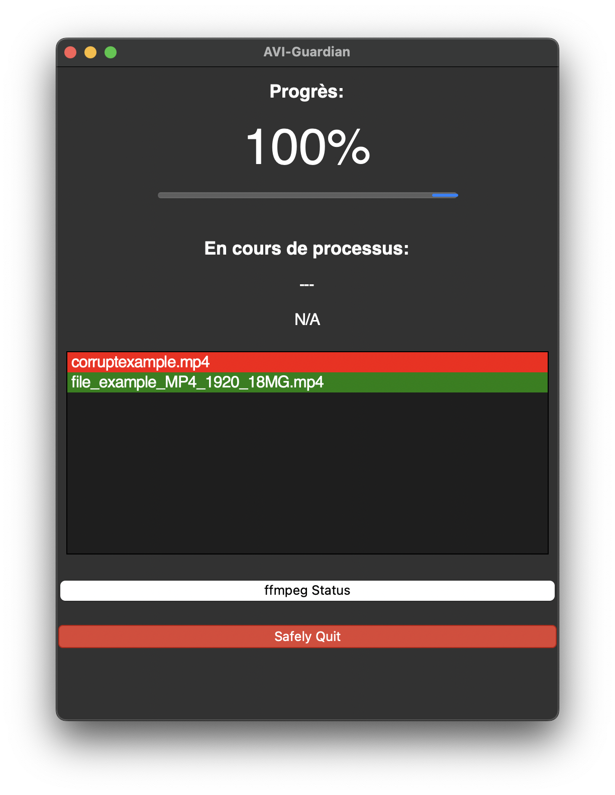

# AVI-Guardian

Cet outil est conçu pour détecter la corruption dans les fichiers vidéo. Il peut analyser divers formats vidéo et identifier les problèmes ou erreurs qui peuvent s'être produits lors de l'encodage, de la transmission ou du stockage.

## Fonctionnalités

- Prend en charge plusieurs formats vidéo (MP4, AVI, MKV, etc. Se référer à `formats.txt`)
- Utilise `ffmpeg` comme outil vidéo pour détecter les problèmes de corruption
- Vérifie les problèmes de corruption courants comme la perte de données, les erreurs de bits et les problèmes de synchronisation

## Installation

### Mac OS
Téléchargez l'application [ici](https://github.com/ngarantBeauvoir/AVI-Guardian/releases/download/v1.0/AVI-Guardian.app).

### Windows
Téléchargez l'application [ici](https://github.com/ngarantBeauvoir/AVI-Guardian/releases/download/v1.0/AVI-Guardian.exe).

### Linux
*À venir*

## Utilisation

1. Lancez l'application et choisissez un dossier vidéo.

2. Lancez l'analyse.

## Exemple

## Installation manuelle

1. Clonez le dépôt :

    `git clone https://github.com/ngarantBeauvoir/AVI-Guardian`

2. Créez un environnement virtuel Python :

    `python3 -m venv .venv`

    `source .venv/bin/activate`

2. Installez les dépendances requises :

    `pip install -r requirements.txt`

    `brew install python-tk`

### Mac OS

1. Créez l'exécutable avec [`py2app`](https://py2app.readthedocs.io/en/latest/) :

    `python setup.py py2app`

1. Lancez l'application :

    `open -a dist/AVI-Guardian.app`

    **Ou**

    `./dist/AVI-Guardian.app/Contents/MacOS/AVI-Guardian`

    **Ou**

    Double-clic sur l'application dans Finder.

## Contribution

Les contributions sont les bienvenues ! Veuillez ouvrir un problème ou soumettre une demande d'extraction si vous avez des améliorations ou des corrections de bogues.
